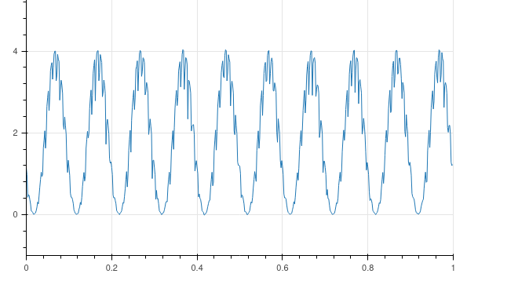

# Hot Film Sampling with LabJack

This repository contains code to use a [Labjack T7](https://labjack.com/t7) to
sample at least 4 hotfilm AD channels at up to 2 KHz and record the channels
to disk in NIDAS dat archive format.

Links:

- [Installation](Install.md)
- [Changelog](Changelog.md)
- [LabJack U6](LabJackU6.md)

## Running

### Systemd service

For the M2HATS project, the service unit has already been installed for the
daq user on `ustar` and `t0t`.  See [Install](Install.md) for details.

### Starting and stopping with systemctl

```plain
systemctl --user start hotfilm
systemctl --user stop hotfilm
```

### Showing run status

Below are commands to check the run status through `systemd`.  See
[Diagnostics](#diagnostics) section for ways to monitor the actual data.

```plain
(base) [daq@ustar hotfilm]$ systemctl --user status hotfilm.service 
- hotfilm.service - Hotfilm Data Acquisition
     Loaded: loaded (/home/daq/.config/systemd/user/hotfilm.service; linked; preset: disabled)
     Active: active (running) since Sun 2023-07-30 15:34:46 MDT; 1h 34min ago
   Main PID: 1084344 (hotfilm)
      Tasks: 11 (limit: 38243)
     Memory: 235.1M
        CPU: 31.620s
     CGroup: /user.slice/user-1000.slice/user@1000.service/app.slice/hotfilm.service
             └─1084344 /opt/nidas-dev/bin/hotfilm --xml hotfilm.xml

Jul 30 15:34:48 ustar.field.eol.ucar.edu bash[1084344]: 2023-07-30,15:34:48|INFO|Stream started. Actual scan rate: 2000.00 Hz (10000.00 sample rate)
Jul 30 15:34:49 ustar.field.eol.ucar.edu bash[1084344]: 2023-07-30,15:34:49|INFO|creating: raw_data/hotfilm_20230730_213448.dat
Jul 30 15:38:55 ustar.field.eol.ucar.edu bash[1084344]: 2023-07-30,15:38:55|INFO|inet:192.168.1.10:31000: setNonBlocking(true)
Jul 30 16:00:01 ustar.field.eol.ucar.edu bash[1084344]: 2023-07-30,16:00:01|INFO|creating: raw_data/hotfilm_20230730_220000.dat
```

The log can also be shown with `journalctl`:

```plain
journalctl --user -u hotfilm
```

### Scheduling priority

The `hotfilm` program tries to set a realtime FIFO scheduling policy with
priority 50.  It must be given permission for this either by starting as root
or by having the appropriate capabilities on the installed file.  This is more
important on a DSM and less important, if not completely unnecessary, on
`ustar`.

If the file capabilities have been set, then `hotfilm` can be started as a
non-root user but will still be able to set realtime schedule priority:

```plain
$ getcap /opt/local/nidas-buster/bin/hotfilm 
/opt/local/nidas-buster/bin/hotfilm cap_net_admin,cap_sys_nice=ep
$ /opt/local/nidas-buster/bin/hotfilm --xml hotfilm.xml 
2023-07-19,00:32:30|INFO|nchannels=4, resolution=4, scanrate=2000, scans_per_read=1000, pps=on, settling=0, range=10
2023-07-19,00:32:30|INFO|thread policy=1 (FIFO=1), priority=50
...
```

Note the executable file has the `cap_net_admin` capability, but technically
only `cap_sys_nice` is necessary to set realtime priority.  The extra
capability prevents some confusing error messages when the NIDAS library tries
to add effective capabilities with `cap_set_proc()`, even though the effective
capabilities are already set on the file.  See [Install.md](Install.md).

The other option is to start `hotfilm` as root so it has permissions to set
the scheduling parameters, and then switch to a different user with the `-u`
argument.  The `-E` argument to `sudo` preserves the environment so project
environment variables like `DATAMNT` can be expanded in the XML file:

```plain
daq@dsm214:~/hotfilm $ sudo -E -s  hotfilm -u daq --xml hotfilm.xml 
[sudo] password for daq: 
2023-06-29,21:32:57|INFO|thread policy=1, priority=50
...
```

### Configuration

The default settings are 4 channels at 2 KHz at the resolution index 4 (out of
8), with the PPS counter and timestamp synchronization enabled.  See `hotfilm
-h` for all the available command-line arguments.  Resolution index 4 has a
maximum rate of 2.2 KHz for the LabJack T7 for 4 channels.  This is based on
the table on the [T-series data rates
page](https://labjack.com/pages/support?doc=%2Fdatasheets%2Ft-series-datasheet%2Fa-1-data-rates-t-series-datasheet%2F).

### Data output

Like for a NIDAS `dsm` process, the `hotfilm` process is configured with an
XML file which can specify multiple sample outputs, usually a file archive and
a sample server socket.  The default [hotfilm.xml](hotfilm.xml) file includes
the typical NIDAS output streams, in particular an archive file data stream
and real-time sample output on port 31000.

Unlike the sensors in a normal `dsm` process, the samples recorded by
`hotfilm` are not raw character streams which have to be processed to generate
samples with numbers corresponding to variables.  Instead, the output samples
already contain floating point numbers (*float* type) broken out into different
samples for each channel and different samples for diagnostics.  The sample IDs
can be used to differentiate and filter them easily.

In [hotfilm.xml](hotfilm.xml), the sensor class in the definition is just a
placeholder.  That sensor class never actually reads any data into samples or
processes any raw samples.

At the moment, the IDs in the `hotfilm` output samples are hardcoded to match
the ones in the `hotfilm.xml` file.  When recording samples, the `hotfilm.xml`
file is only used to setup the sample outputs.  When reading the output
samples, the XML is used to asociate tag information with the samples
according to the sample IDs.

Current versions of NIDAS utilities like `data_dump` and `data_stats` expect
file archives to have only raw samples containing character data.  They will
filter samples at best or possibly crash if `-p` is used with the files.  This
is being fixed on the `buster` branch and will eventually be fixed in a NIDAS
release.

### Plotting

There is a python web application script, built on the bokeh framework, for
plotting the channel data in real time.  It runs `data_dump` connected to the
`hotfilm` sample output, parses the channel arrays, then updates them in the
bokeh app so the web client can plot the updates in real-time.  Run the web
application like so:

```plain
bokeh serve --show app_hotfilm.py --args sock:localhost:31000
```

The last argument is passed to the `data_dump` command, so use whatever works
to connect to the running `hotfilm` program.  For example, the above command
starts the web app on `ustar` when `hotfilm` is running on `ustar`.  The
`--show` argument automatically opens a browser window to the local app server
instance on the right port.

For the web app to run on `ustar` but accept connections from browsers on
other hosts, use this command on `ustar`:

```plain
bokeh serve --allow-websocket-origin=192.168.1.10:5006 --port 5006 app_hotfilm.py --args sock:localhost:31000
```

Then browse to url `http://192.168.1.10:5006/`.

The browser app can plot one of the four channels in either the time or
frequency domain, for each second of data output as a sample.

### Diagnostics

This is an example of using `data_dump` to show all the 1-second statistics
and diagnostics without the full 2000-point 1-second time series:

```plain
daq@dsm214:~/hotfilm $ data_dump -i -1,501 -i -1,510-513 hotfilm_20230629_203645.dat 
2023-06-29,21:32:08|INFO|opening: hotfilm_20230629_203645.dat
2023-06-29,21:32:08|NOTICE|parsing: hotfilm.xml
|--- date time --------|  deltaT   id          len data...
2023 06 29 20:36:45.7860       0 200, 501      20          1        428          0         48        506 
2023 06 29 20:36:45.7860       0 200, 510      12 0.00052848 -0.0036095  0.0049213 
2023 06 29 20:36:45.7860       0 200, 511      12  0.0046688 0.00081343   0.052004 
2023 06 29 20:36:45.7860       0 200, 512      12 -0.0075408  -0.036148   0.014717 
2023 06 29 20:36:45.7860       0 200, 513      12 0.00053158 -0.0074004  0.0087132 
2023 06 29 20:36:46.7860       1 200, 501      20          2        428          0         96        510 
Exception: EOFException: hotfilm_20230629_203645.dat: open: EOF
```

Sample 501 has 5 variables:

- PPS count: latest counter value for the PPS DIO channel.  This will be 0 if
  no PPS pulses have been ever counted by the LabJack.  It should normally
  increment by one for each sample.
- PPS index (aka step): index of the counter change (PPS pulse) in the scans
  in the 1-second sample, from 0 to 1999.  If -1, then no change in the PPS
  counter was detected in this sample, so the time tags were not adjusted to
  synchronize with the PPS time.
- Device scan backlog: scans left in the device buffer after the last read;
  should be near zero and not increasing.
- Host scan backlog: scans still in the host-side buffer; should be near zero
  and not increasing.
- Time of last read in ms: this should be close to 500 ms.  The stream is
  configured to read half a second of samples at a time.  So the time spent in
  the read call should be mostly waiting for a half-second of scans to fill
  up, or about 500 ms.  If it gets small then the host sample writing has
  fallen behind and is catching up.  If it gets large then the reads from the
  device are being delayed, such as by network congestion or delays in the LJM
  library itself.

Samples 510-513 are the avg/min/max for channels 0-3 over the full second of
data in the corresponding samples 520-523.

Showing stats on any of the samples can indicate if there are any
synchronization issues.  The rate and the min/max time between samples should
be 1.0 on any continuously running sample stream:

```plain
daq@dsm214:~/hotfilm $ data_stats -i 200,501 hotfilm_20230629_213259.dat  hotfilm_20230629_220000.dat 
2023-06-29,22:38:38|NOTICE|parsing: hotfilm.xml
Exception: EOFException: hotfilm_20230629_220000.dat: open: EOF
sensor  dsm sampid    nsamps |------- start -------|  |------ end -----|    rate minMaxDT(sec) minMaxLen
        200    501      3939 2023 06 29 21:32:59.101  06 29 22:38:37.104    1.00  1.000  1.001   20   20
```

Logging can also be helpful.  Turn on debugging log messages with `--log
debug`.  The `--diag` command-line argument enables extra LJM calls to report
on the TCP buffer status and check for skipped scans.  However, for normal
operations, that probably adds more overhead than it's worth.

## Exporting hotfilm data

The script [dump_hotfilm.py](dump_hotfilm.py) can translate NIDAS archive
files into a column text format using `data_dump`.  Run `dump_hotfilm.py -h`
to see usage.

This is the command used to export data for M2HATS on `ustar`.  The text files
have two columns, first column is floating point seconds since the epoch, and
the second column is channel 1, ie, the hotfilm at the 1m sonic.

```plain
dump_hotfilm.py --log info --channel 1 --timeformat %s.%f --text text_%Y%m%d_%H%M%S.epoch.txt /data/isfs/projects/M2HATS/raw_data/
```

The script creates output files of uninterrupted, contiguous scans, by default
at least 30 minutes and no more than 4 hours.  The min and max limits can be
adjusted with command-line arguments.

The text files can be compressed afterwards.

## Todo

The diagnostic samples can be viewed in real-time using the tips above, but
they are not yet available through a DSM dashboard.  The diagnostics could be
relayed as UDP packets to another DSM instance, which then includes those
variables in the dashboard.  Or `hotfilm` could run on its own DSM with its
own dashboard, and the `json_data_stats` service could be configured to dump
only the diagnostic samples.

## Implementation Notes

The `hotfilm` program runs similarly to the NIDAS `dsm` process.  However,
rather than `DSMEngine` controlling the sensor opening, polling, and reading,
the `hotfilm` program calls the LabJackM library in sequence to open the
device and read the stream, blocking where needed.  This simplifies the logic
of the program and the use of the LabJackM library.  The program is also built
outside of the NIDAS source tree, so it can be built easily on the DSM3 Pi
against buster branch, and so the LabJackM library does not need to be linked
into NIDAS.

The LabJackM library does provide a callback API using
[SetStreamCallback](https://labjack.com/pages/support?doc=/software-driver/ljm-users-guide/setstreamcallback/),
so the callback can be used to notify when the stream buffer is full and ready
to read with
[LJM_eStreamRead](https://labjack.com/pages/support?doc=/software-driver/ljm-users-guide/estreamread/).
That could allow the stream reads to be integrated with the NIDAS
SensorHandler, if the LabJack sensor provided something like a file descriptor
on a pipe to which the callback could write to indicate data are ready to be
read.

### Stream Mode

[This page of the T-series
datasheet](https://labjack.com/pages/support?doc=/datasheets/t-series-datasheet/30-communication-t-series-datasheet/)
implies that a 2 KHz scan rate should use Stream mode rather than
command-response mode, so that is what `hotfilm` uses.

### PPS Counter

The DIO0 channel is configured as a counter to detect PPS pulses.  Given
register settings below:

```plain
DIO0_EF_ENABLE=0
DIO0_EF_INDEX=8
DIO0_EF_ENABLE=1
```

Then `DIO0_EF_READ_A` will be the current counter, and that channel can be
streamed also.

- [DIO extended features page](https://labjack.com/pages/support?doc=%2Fdatasheets%2Ft-series-datasheet%2F132-dio-extended-features-t-series-datasheet%2F)
- [Interrupt Counter](https://labjack.com/pages/support?doc=/datasheets/t-series-datasheet/1329-interrupt-counter-t-series-datasheet/)

On the DSM3, PPS is on GPIO26.  That can be wired to the LabJack FIO0 input
using the handy stackable [Pi-EzConnect breakout
board](https://www.adafruit.com/product/2711).  One of the GND screw terminals
on the breakout has to be wired to the GND input next to the FIO0 terminal.

The LabJack T7 also supports external triggers, so in theory the PPS could be
used to trigger the start of a scan, and that might save some overhead from
streaming the pulse counter at the same rate as the AIN channels.  However,
that option was rejected so that sampling can happen even in the absence of
the PPS.  If the counter synchronization proves reliable, then the full
counter stream could be left out of the recorded data to at least avoid that
overhead.

### Time tagging

If a change in the PPS counter is detected in the scans for that channel, the
sample time tags for all the channels are computed relative to that specific
scan, called the `pps_step` in the code and assigned that variable name in the
output sample tags.  The step index is -1 if a change in the counter was not
detected in the last 2000 scans, otherwise it is in the interval 0-1999.

If the counter changed value in the last read buffer, covering the last
half-second, then the current system second should be the second at which the
pulse happened, as long as the system time is acquired within a half-second
after the read returns.  To compute the start of the sample, the system time
is truncated to the even second, then that time is decremented by the amount
of time represented by the step index, `pps_step/2000`.  The sample data are
not shifted in any way so that the sample time falls on an even second.
Instead the time tag is adjusted so that the time of the sample at `pps_step`
falls on the even second, since that is when the pulse happens.

If there is ever a significant delay, more than half a second, between the
last scan in the LabJack buffer and the return of the system time after the
buffer is read, then the system time could advance to the next second, past
the second corresponding to the PPS pulse in the counter channel.  This would
be evident by a 2-second difference between successive sample times.

This 0-second or 2-second difference is detected by the time tag algorithm,
and the time tag is adjusted to align it with the expected time tag.  However,
this has some risk.  If the very first timestamp is off by a second, then all
subsequent timestamps will keep being adjusted and will also be off by one
second.

Just in case such a situation ever needs to be detected and corrected, the
difference between the timestamp and the system time is stored in the PPS
statistics sample as variable `timetag_to_system`.  Adding that value to the
sample time tag yields the system time that was returned after the stream read
completed.  That is the time from which the sample time tag is derived, either
by backing off according to `pps_step`, or else by backing off a full second
from the system time after the second read a get an approximate start of the
scans in the previous read.

Here are a few thoughts about how to guard against time tag errors from such a
significant delay, if it were to become a problem.  There could be a check
that the system time "seems reasonable" relative to the previous sample time
and the value of `pps_step`.  Or, since the time spent in the read is likely
to coincide with the time covered by the count, then maybe the average of the
system time before and after the stream read would be a better starting point
to determine the time at the PPS pulse, perhaps interpolated by  the step
index so the time `after` the read returns is more heavily weighted the larger
the step index.  This seems risky, though, since there is a chance the time
`before` the read could pull the estimated system time of the pulse into the
previous second.  The interpolated time might have to be incremented by a
half-second before being truncated.

It might also help to read the scan buffer more often.  The recommendation in
the LabJack Stream examples is to read 1/2 the scan rate at a time.  However,
maybe reading 1/4 at a time makes it more likely to detect the count change in
the right second of system time, since there is then 3/4 of a second between
the last scan being read and when the system time call must return.

### Differential

All the analog inputs are configured as differentials, so each channel
requires a pair of analog input terminals.  Channel 0 is AIN0+ and AIN1-,
channel 1 is AIN2+ and AIN3-.  In the code, the even inputs are named in the
scan list: AIN0, AIN2, AIN4, AIN6.

### Resolution

The scan resolution is set to 4 by default, the highest possible resolution
index for the 2 KHz scan rate and 4 channels.

LJM provides the option to read 16-bit data instead of converting to float on
the host side.  However, there does not seem to be any disadvantage to
recording the data already scaled to Volts.  One downside is that 32-bit
floats take twice as much space, but that is unlikely to be a problem.

### Interference

When testing the LabJack in the lab, the power source for the LabJack seems to
affect the digitization when also using a waveform generator.  When powered
through a laptop, the digitized waveform signal looks clean.  When powered by
the DSM USB or by the LabJack AC-USB adapter, the signal drops towards 0 V at
somewhat regular intervals.  Here is an example:

.

The interference does not seem to happen without the waveform generator
connected, regardless of the LabJack power source.  Or so we hope.

## Example Data

### sawtooth.dat

- **channel 0**: AA battery reading ~1.7V
- **channel 1**: sawtooth waveform 1 Vpp and 1 V offset, 50 Hz, but actually
  reading at 2V offset and 1 Vpp

LabJack was powered by the USB port on the waveform generator.

### sinewave.dat

- **channel 0**: hotwire through the bridge
- **channel 1**: 990 Hz 5 mVpp sine wave

The hot wire was blown on several times and then fanned it with a flat box
lid.
