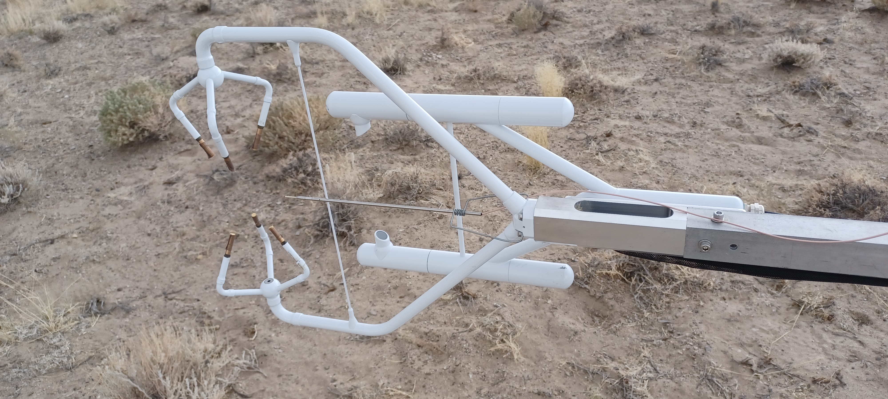

# Hotfilm Calibration

The raw hotfilm data only contains the bridge voltages ($E_b$) measured on
each channel of the A/D, one channel for each deployed height.  Wind speed
is derived by calibrating the voltages against the 3D sonic anemometer
deployed at the same height.  The hot film was mounted within 20 cm of the
sonic at the same height as the sonic sample volume, on the same boom as
the sonic but closer to the tower.

These photos show the general orientation during M2HATS:

[Hotfilm relative to sonic](hotfilm_relative_to_sonic_20230719_172532.jpg)

[Hotfilm and sonic fetch](hotfilm_sonic_fetch_20230719_172554.jpg)

## Calibration Equations

The calibration assumes this relationship between hotfilm bridge voltage
and wind speed:

> $E_b^2 = a + b * Spd^{{0.45}}$

The coefficient names $a$ and $b$ match the usage in
https://www.thermopedia.com/content/853/, and they are intenionally
different from the usual linear coefficients of $ax + b$, even though the
coefficients are calculated from a linear least squares fit.

The wind speed across the hot film is then derived from $E_b$ with the
coefficients $a$ and $b$:

> $Spd = ((E_b^2 - a)/b)^{{(1/0.45)}}$

It is assumed the wind component parallel to the hot film does not
contribute to the cooling of the hot film and thus not to the voltage
change, so the voltage is calibrated against the wind speed in the plane
orthogonal to the hot film.

For M2HATS, the hot films were oriented horizontally for most of the
project, so wind speed across the hot film is derived from the $u$ and $w$
sonic wind components, in instrument coordinates.  In instrument
coordinates, the sonic $u$ points into the boom towards the tower, and $w$
is the vertical component.

> $Spd = (u^2 + w^2)^{{1/2}}$

The hot films were mounted to the same boom as the sonic, so the
calibration wind speed should not depend on any tilt in the sonic (relative
to earth) due to the boom.  However, the hot film mount and the hot film
itself were aligned manually by sight, so it is possible there is some
calibration error if the hot film alignment allows unexpected influence
from the $v$ component.

## Quality of Fit

The calibration computes a few quality of fit metrics.  These plots give an
example of how they compare.

The plots use a range from 2 to 3 Volts, and the sonic speed is simulated
by computing wind speed according to the equation above and adding noise of
magnitude 1 with alternating sign.

The upper plot is in Volts versus Speed, while the lower plot shows the
linear space where the least squares fit is calculated, $Spd^{{0.45}}$
versus $E_b^{{2}}$.

### Coefficient of Determination

$R^2$ [Coefficient of
Determination](https://en.wikipedia.org/wiki/Coefficient_of_determination)
is computed for both speed and the linear fit.

$R_{{spd}}^{{2}}$ uses the difference between the sonic speeds and
predicted speeds to compute the residual sum of squares.

However, the actual least squares fit is calculated by assuming a linear
relation between $Spd^{{0.45}}$ and $E_b^{{2}}$, so that Coefficient of
Determination is calculated also, called $R_{{fit}}^{{2}}$, since it might
be useful in assessing the quality of the linear fit.  $R_{{spd}}^{{2}}$
will naturally be higher since the total sum of squares (difference from
the mean) will be much larger in the $Spd$ domain versus $Spd^{{0.45}}$.

### RMS

RMS is the standard deviation of the difference between the calibration
curve fit and the sonic speed, so it can give an estimate of the magnitude
of the noise and any voltage variations not captured by the calibration
equation, such as due to temperature or low wind speed.  In the example
plot above, the simulated noise with magnitude 1 $m/s$ yields a RMS value
of 1.05 $m/s$.

## Implementation

The implementation of the calibration is in
[hotfilm_calibration.py](../hotfilm/hotfilm_calibration.py).

Currently only $R_{{spd}}^2$ and RMS are written to the hotfilm wind speed
NetCDF files.
